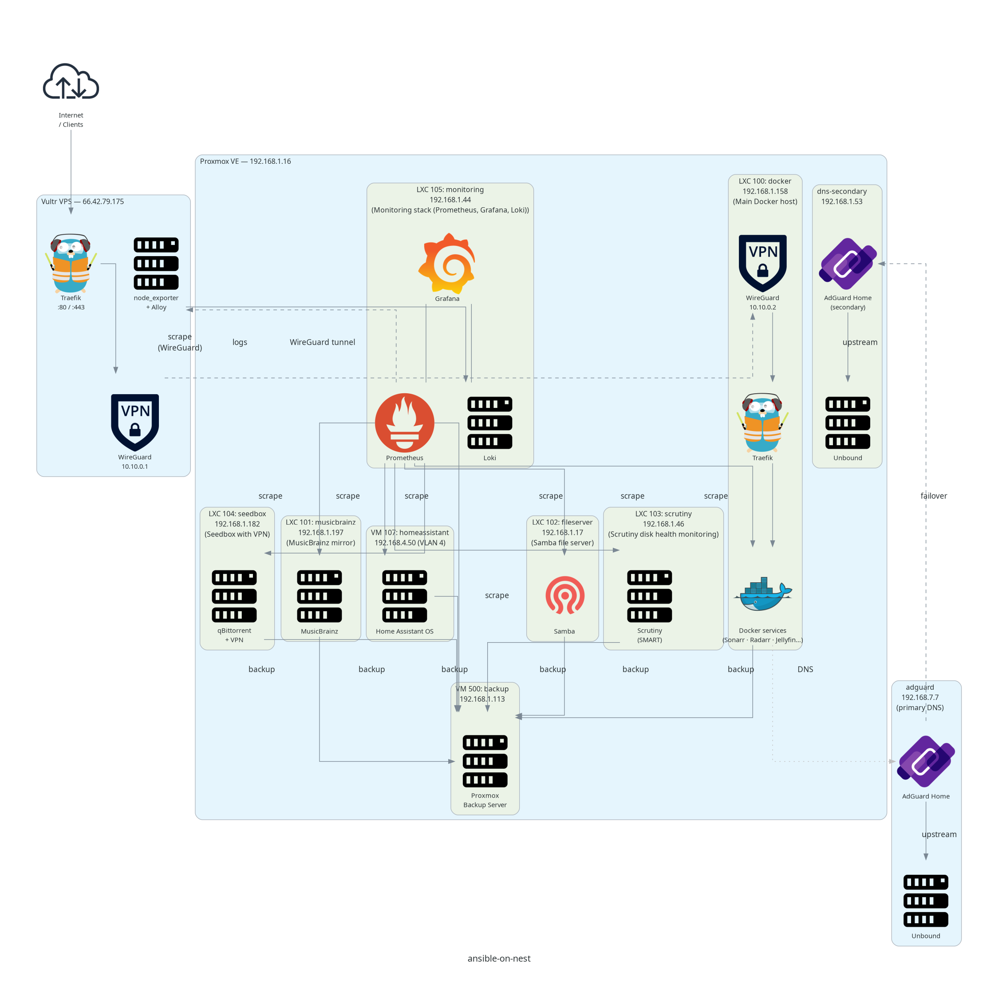
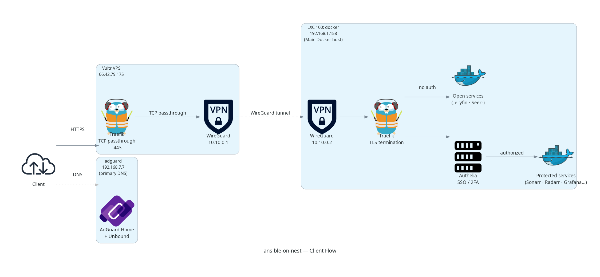

# ansible-on-nest

Terraform + Ansible IaC for a Proxmox home lab with a Vultr VPS proxy.

## Architecture

### Full diagram


### Client ingress flow


> Diagrams are generated from the live IaC — run `python3 scripts/generate_diagram.py` to regenerate.
> Requires `graphviz` and `pip install -r scripts/requirements-diagram.txt`.

## Layout

```
terraform/          HCL resources (PVE LXCs/VMs, AdGuard DNS rewrites)
playbooks/          Ansible — post-provision config, Docker services, nftables
inventory/          hosts.yml
scripts/            Tooling (diagram generation)
docs/               Generated outputs
```

## Quick commands

```bash
# Apply infra
terraform -chdir=terraform apply -var-file=secrets.tfvars

# Run all playbooks
ansible-playbook playbooks/site.yml --ask-vault-pass

# Regenerate diagrams
python3 scripts/generate_diagram.py
```
